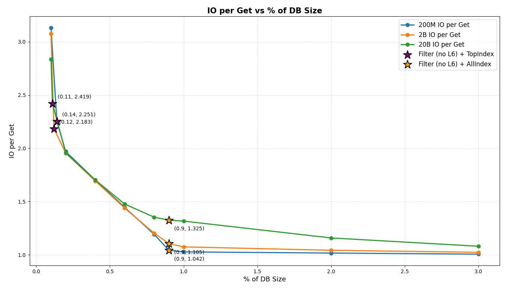
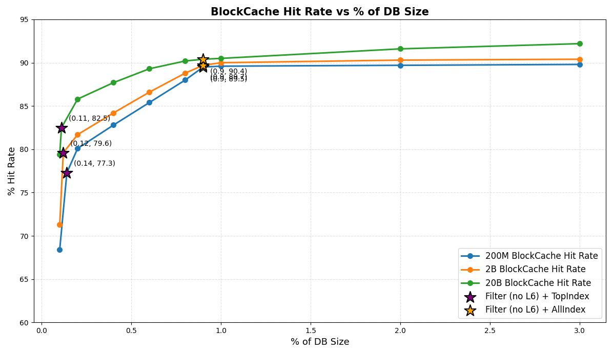

# bench_kvdb

A benchmarking tool designed to evaluate random read performance of traditional KV databases such as **Pebble**, 
specifically focusing on **IOs operations per key read (I/O per GET operation)**.

This project originated from research around the new trie database design proposed in the Base TrieDB 
repository (https://github.com/base/triedb/), the following design assumption is stated:

> While traversing the trie from Root to Leaf in order to read a single value is predicted to scale logarithmically  
> with the size of the trie (`O(log N)`), this is also the cost associated with accessing each item stored in a 
> Key/Value database. In effect, the database must be fully searched for each independent trie node, and
> this work must be repeated until a Leaf node is found, resulting in a true scaling factor of O(log N * log N).

---

## Why This Project Exists

Many blockchain research discussions assume that KV DB (like pebble) requires approximately `O(log N)` IOs to perform a key lookup.

However, this assumption may be **incorrect** in the actual scenarios of blockchain.

### Pebble’s Level Structure 

Pebble uses a level-based LSM design where the base level (LBase) is capped at 64 MB, and each subsequent level increases 
in capacity by a factor of 10. 


The example shown above contains 7.9 B key–value pairs stored across `14,840 SST` files distributed over levels L2–L6, 
with most data concentrated in L6 (≈393 GB). Intermediate levels follow the expected ~10× growth pattern, 
though Pebble treats this as a soft target rather than a strict limit.

Pebble also maintains a dynamic **LBase**, which is the base level currently selected by the compaction scheduler 
as the primary target for L0 compactions. LBase selection depends on level sizes and compaction pressure. 
In this snapshot, L1 is empty and L2 holds only ~54 MB, so **L2 is effectively the current LBase**.

### SST File Structure and Usage in Pebble

SST (Sorted String Table) is the core storage unit in Pebble. Each file contains multiple sections, each serving a specific purpose:

```
+-------------------+
|    Data Blocks    |  <- Actual key-value entries, read when Bloom filter/index indicates key exists
+-------------------+
|   Filter Block    |  <- Bloom filter, quickly checks if a key may exist, avoids unnecessary reads
+-------------------+
|   Index Blocks    |  <- Maps key ranges to data block offsets, helps locate data
+-------------------+
|  Top-Level Index  |  <- High-level index pointing to index blocks for faster lookup, read at iterator init
+-------------------+
|    Properties     |  <- File metadata (record count, global seq num)
+-------------------+
|    Meta-Index     |  <- Pointers to auxiliary data (filters, value blocks)
+-------------------+
|      Footer       |  <- Offsets for top-index and meta-index
+-------------------+
```

### Read Path in Pebble
A typical Get (key lookup) proceeds as follows: 
1. Check MemTable / Immutable MemTables (in memory - no I/O)

2. Consult MANIFEST metadata (in memory - no I/O)
    - Used to determine candidate SST files.
    - Already loaded in memory after DB open.

3. Search SST files (all levels)
    - L0: Multiple SSTs may need to be checked due to overlapping key ranges.
    - `LBase` and higher: SSTs have non-overlapping key ranges; at most one SST per level is queried.
      
   For each SST file
    - Read the Top-Index at iterator init
      - Small structure at the end of each SST providing offsets to index blocks.
      - Usually cached; if not, 1 disk read. (~0 I/O)
    - **Bloom Filter check**
      - Table-level filter for the whole SST
      - If cached → no I/O
      - If not cached → 1 disk read to load the filter block
      - A high Bloom filter hit rate is crucial:
        If the filter says the key does not exist, the SST can be skipped entirely — meaning the lookup
        cost for a non-existing key is almost zero I/O.
    - If the Bloom Filter indicates the key may exist:
      - Index Block lookup → 0–1 I/O depending on cache state
      - Data Block read → 0–1 I/O depending on cache state
      - If found → return value.
    - Special optimization for the last level (L6)
      - L6 intentionally does not use Bloom filters.
      - The lookup directly uses the index block to locate the data block.
      - Reason for this optimization:
        - L6 contains the largest portion of the database.
        - The Bloom filter for L6 would be very large, with: 
          - Low cache efficiency
          - High memory cost
          - Diminishing filtering benefit (since most keys eventually fall into L6)
        - The index already provides efficient block-level pruning.
      - Therefore:
        - Skipping the L6 Bloom filter saves cache space
        - Avoids one extra disk read
        - Reduces total I/O and memory pressure

4. Continue downward through levels
    - Stop when the key is found, 
    - Or return `NotFound` after all candidate SSTs have been checked.


In simple terms:
```
1. Check MemTable / Immutable MemTables
2. Check MANIFEST → candidate SSTs
3. For each SST:
   a) Table-level Bloom filter → skip SST if key absent
   b) Top-level index → find index block
   c) Index block → locate data block
   d) Data block → read value
```

### Theoretical I/O Behavior

If the database has X non-empty levels (as shown in the example above, L2, L3, L4, L5, L6 → X=5), 
The theoretical worst-case disk I/O count per Get operation is:

$$
\text{I/O} \approx (X - 1) * 2 + 3
$$

| Term    | Meaning                                    |
|---------|--------------------------------------------|
| (X - 1) | All levels except L6                       |
| * 2     | Top Index block + Filter block             |
| + 3     | Top Index block + Index block + Data block |

Which leads to the commonly quoted:
> Theoretical complexity: O(log N)

This reflects the fact that an LSM tree has logarithmic fan-out across levels.

### Why `O(log N)` Does Not Reflect Reality
In real blockchain workloads (e.g., Geth, Optimism), the theoretical `O(log N)` bound significantly overestimates real 
disk I/O, mainly due to the behavior of Bloom filters and cache residency.
1. Bloom Filters Prevent Most Useless I/O
    - Bloom filters are checked before the index and data blocks.
    - If the filter says “key does not exist”, the SST is skipped with:
      - No index block read
      - No data block read
    - This effectively removes most negative lookups from touching disk.

2. Bloom Filters Excluding L6 + Top-Index Are Small
    - Typical Bloom filter size (for all levels except L6) + Top-Index size (`≈ 0.18%` of total data size in the Ethereum sample)
    - Bloom filters and Top-Index:
      - Are accessed on almost every `Get`
      - Are highly cache-friendly
      - Have extremely high reuse
    - Therefore, if:  
      > Cache Size > Bloom filter size without L6 + Top-Index size
    - then
      - Almost all Bloom filters and Top-Indexes remain resident in memory
      - Bloom filter lookups incur ~0 I/O
      - Top-Index block → 0 I/O
      - Combined with index and data block reads, the total I/O per Get operation tends toward 2 (1 for index, 1 for data block)

3. I/O Cost with Sufficient Cache
    - Cache can hold: `Bloom filters` + `All Index blocks` (`≈ 1.3%` of total data size in the Ethereum sample)
    - Then for most Get operations:
      - Bloom filter → 0 I/O
      - Top-Index block → 0 I/O
      - Index block → 0 I/O
    - So the real cost becomes:
      - `≈ 1–2 I/Os per Get` operation → Effectively O(1)
      - If the cache is even larger and hot data blocks are cached and have a high hit rate, I/O per Get operation can drop below 1

### Hypothesis: Pebble Achieves O(1)-Like Read I/O Under Sufficient Cache
Although the theoretical read complexity of Pebble is `O(log N)` due to the multi-level LSM structure, 
This does not reflect real-world behavior. Thanks to: 
- The small size of Bloom filters, excluding L6,
- Their very high access frequency,
- And sufficient cache residency,

Most negative lookups are filtered out in memory, and positive lookups usually require only one or two data blocks read.

We hypothesize that
> With sufficient cache, the real read I/O complexity of Pebble is effectively O(1) and converges to 1–2 I/O per Get operation.


### Benchmark Plan: Validating the O(1)-Like Read Behavior

To verify the previous hypothesis, the benchmark will:

1. Use **Pebble** (the same storage engine used by Geth).

2. Test multiple cache configurations:
    - From 0.1% of the DB Size, which is smaller than `Filter (without L6) + Top Index`
    - To 3% of the DB Size, which is larger than `Filter (without L6) + All Index`

3. **Warm-up phase (to eliminate cold-cache effects):**
    - Before formal measurement, pre-read approximately **0.05% of the total key space**.
    - Purpose:
        - Populate Bloom filters, Top-index blocks, and hot index blocks into cache,
        - Ensure the system reaches a **steady-state cache behavior**.
    - Only after the warm-up completes will formal statistics be collected.

4. Measure **storage I/O only**, not response latency.

5. Calculate **I/O per Get** using Pebble internal metrics, which closely approximate OS-level I/O behavior:

   > I/O per Get ≈ (BlockCache Miss Count + TableCache Miss Count) / Key Lookup Count

6. Dataset sizes:
    - Records:
        - Small DB: 200M keys
        - Medium DB: 2B keys
        - Large DB: 20B keys
    - Keys: 32-byte hashes
    - Values: 110 bytes, matching the typical average value size in Ethereum trie storage.

---

## Build & Run

### How to Build

```bash
git clone https://github.com/QuarkChain/bench_kvdb
cd bench_kvdb/src/bench_pebble
go build
```

### How to Run

**Usage：**
- --i: init insert data, default value is `false`
- --b: batch insert, default value is `true`
- --c: cache size in MB
- --T: total number of keys count
- --t: threads count
- --w: random update count
- --r: random read count
- --p: db path
- --l: log level


```bash
cd ./src/bench_pebble

# init DB 
./run_insert.sh

# get db properties
./run_properties.sh

# run bench
./run_bench.sh
```

## Benchmark Results

### Environment
- CPU: 32 cores
- Memory: 128 GB
- Disk: 7 TB (2 * SAMSUNG MZQL23T8HCLS-00A07 + RAID 0)
- OS: Ubuntu
- Pebble Version: v1.1.5
- Random Read Keys: 10M
- Warn Up Keys: 0.05% of the total keys
- Logs: [`src/bench_pebble/logs/`](https://github.com/QuarkChain/bench_kvdb/src/bench_pebble/logs/)

### Dataset Overview

| Dataset                          | Small            | Medium         | Large           |
|----------------------------------|------------------|----------------|-----------------|
| Keys                             | 200M Keys        | 2B Keys        | 20B Keys        |
| DB Size                          | 22 GB            | 224 GB         | 2.2 TB          |
| File Count                       | 1418             | 7105           | 34647           |
| Filter (without L6) + Top Index  | 32 MB (0.14%)    | 284 MB (0.12%) | 2.52 GB (0.11%) |
| Filter (with L6)                 | 238 MB           | 2.3 GB         | 23 GB           |
| All Index                        | 176 MB           | 1.7 GB         | 18 GB           |
| Filter (without L6) + All Index  | 207 MB (0.91%)   | 2.0 GB (0.89%) | 20.5 GB (0.91%) |

**Note:**

The actual percentage of these components depends on the database layout and compaction state.
Therefore, the conclusions below refer to component combinations rather than a fixed % of DB size.

#### Read I/O Cost per Get

| Cache Configuration                 | Small | Medium | Large |
| ----------------------------------- |-------|--------|-------|
| **Filter (without L6) + Top Index** | 2.25  | 2.18   | 2.42  |
| **0.2% DB Size**                    | 1.97  | 1.95   | 1.96  |
| **Filter (without L6) + All Index** | 1.04  | 1.10   | 1.33  |
| **1% DB Size**                      | 1.03  | 1.07   | 1.31  |


#### Filter Hit Rate
| Dataset                             | Small  | Medium | Large |
|-------------------------------------|--------|--------| ----- |
| **Filter (without L6) + Top Index** | 98.5%  | 99.6%  | 98.9% |
| **0.2% DB Size**                    | 100%   | 100%   | 100%  |
| **Filter (without L6) + All Index** | 100%   | 100%   | 100%  |
| **1% DB Size**                      | 100%   | 100%   | 100%  |

#### Top Index Hit Rate
| Dataset                             | Small | Medium | Large |
|-------------------------------------|-------|--------|-------|
| **Filter (without L6) + Top Index** | 96.4% | 97.8%  | 95.4% |
| **0.2% DB Size**                    | 100%  | 100%   | 100%  |
| **Filter (without L6) + All Index** | 100%  | 100%   | 100%  |
| **1% DB Size**                      | 100%  | 100%   | 100%  |

#### Index Block Hit Rate
| Dataset                             | Small | Medium | Large |
|-------------------------------------| ----- |--------| ----- |
| **Filter (without L6) + Top Index** | 2.1%  | 1.5%   | 2.9%  |
| **0.2% DB Size**                    | 9.1%  | 11.8%  | 13.7% |
| **Filter (without L6) + All Index** | 98.2% | 93.1%  | 72.6% |
| **1% DB Size**                      | 99.6% | 95.8%  | 73.4% |


#### Data Block Hit Rate
| Dataset                             | Small | Medium | Large |
|-------------------------------------|-------|--------|-------|
| **Filter (without L6) + Top Index** | 1.0%  | 0.7%   | 1.3%  |
| **0.2% DB Size**                    | 1.2%  | 0.9%   | 1.6%  |
| **Filter (without L6) + All Index** | 1.4%  | 1.1%   | 2.4%  |
| **1% DB Size**                      | 1.5%  | 1.2%   | 2.4%  |

#### Overall Block Cache Hit Rate
| Dataset                             | Small | Medium | Large |
|-------------------------------------|-------|--------| ----- |
| **Filter (without L6) + Top Index** | 77.3% | 79.6%  | 82.5% |
| **0.2% DB Size**                    | 80.1% | 81.7%  | 85.8% |
| **Filter (without L6) + All Index** | 89.5% | 89.7%  | 90.4% |
| **1% DB Size**                      | 89.6% | 90.0%  | 90.5% |



#### Analysis
- When cache ≥ `Filter (without L6) + Top Index`:
  - Filter and Top Index hit rates rise rapidly with cache size and quickly converge toward 100%.
  - Almost all negative lookups are resolved entirely in memory.
  - I/O per Get drops rapidly as cache continues to increase from around ~2.2–2.4.
- When cache ≥ `Filter (without L6) + All Index`: 
  - I/O per Get converges toward ~1.0–1.3.
  - The rate of further I/O reduction slows down significantly as cache continues to increase. 
- Data block hit rate remains low and has **limited impact on overall I/O**.
- The **dominant factor** for I/O reduction is **Bloom filter and index residency**, not data block caching.
- These behaviors are **independent of total DB size** (22GB → 2.2TB).


## Conclusion & Recommendations
### Conclusion: Pebble Achieves O(1)-Like Read I/O Under Sufficient Cache

Although the theoretical read complexity of Pebble is `O(log N)` due to its multi-level LSM structure, 
this complexity does not directly translate into real-world read I/O behavior.

Experimental results show that:
- Once `Filter (without L6) + Top Index` is resident in cache, almost all negative lookups are resolved entirely in memory, and I/O per Get rapidly drops to ~2 or less.
- When `Filter (without L6) + All Index` fits in cache, I/O per Get further converges toward ~1.0–1.3, after which additional cache yields only marginal I/O reduction.

These behaviors are consistent across database sizes ranging from **22GB to 2.2TB**.

> With sufficient cache residency of Bloom filters and index blocks, the practical read I/O behavior of Pebble is 
> effectively **O(1)** and consistently converges to **1–2 I/O per Get operation**.


### Cache Configuration Recommendations

1. Minimum cache for near-constant read performance  
   The cache should be large enough to hold:
   - `Filter (without L6) + Top Index`  
     This already eliminates almost all negative lookups and reduces I/O per Get to ~2.

2. Optimal cache for near-single-I/O reads  
   The cache should be large enough to hold:
   - `Filter (without L6) + All Index`  
     At this point, I/O per Get consistently converges to ~1.0–1.3 even at tens of billions of keys.

3. Data block caching is optional for read I/O optimization  
