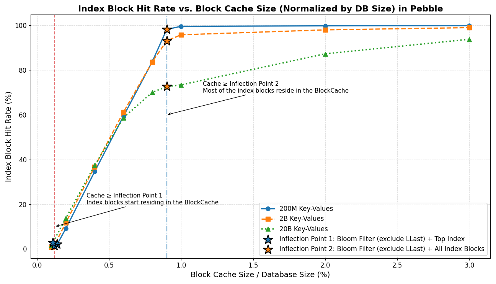
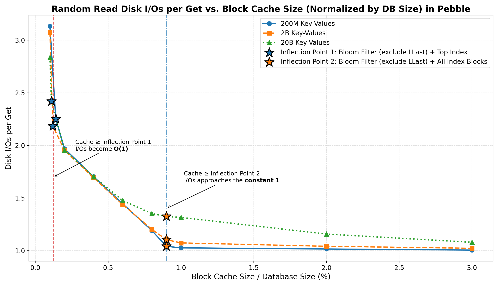

# Understanding the Practical Disk I/O Cost of KV Lookups in Blockchain Systems
## **An Empirical Study of Pebble under Realistic Blockchain State Workloads**

## Abstract
Many blockchain analyses and performance models assume that key-value (KV) storage reads incur **`O(log N)`** disk I/O 
complexity, especially when using LSM-tree engines such as Pebble or RocksDB. This assumption is rooted 
in the worst-case scenario of SST traversal, where a lookup have to access multiple levels and, at each level, 
examine Bloom filters, index blocks, and data blocks.

However, we find that this model does not reflect real-world behavior. In practice, caches often hold most 
filter and index blocks, which can significantly reduce I/Os.

To understand the practical disk I/O behavior of LSM-based databases under realistic caching conditions, 
we conduct extensive controlled experiments using Pebble as a representative engine, 
spanning datasets from **22 GB to 2.2 TB** (**200M to 20B keys**), and find that:
- Once **Bloom filters (excluding [LLast](#llast)) and [Top-Index blocks](#top-level-index)** fit in cache, 
  **most negative lookups incur zero disk I/O**, and the I/Os per Get operation rapidly drops to ~2.
- When **all index blocks also fit in cache**, the I/Os per Get operation further converges to **~1.0–1.3**, 
  largely independent of total database size.
- Data block caching has only a marginal effect on overall I/O under pure random-read workloads.

Overall, under sufficient cache, **Pebble exhibits effectively O(1) disk I/O behavior for random reads**,
challenging the common assumption that each KV lookup inherently costs `O(log N)` physical I/Os. This has direct implications
for the performance modeling and design of blockchain trie databases and execution-layer storage systems.

---

## Motivation
Blockchain execution layers typically depend on LSM-tree KV stores to serve billions of randomly accessed keys.
A common assumption is:
> “Each KV lookup in an LSM-tree costs `O(log N)` disk I/O.”

However, in real blockchain systems, these assumptions often do not hold.
Modern LSM-based KV engines such as Pebble rely heavily on:
- Bloom filters that eliminate most negative lookups;
- Small, highly reusable index structures;
- Block cache and OS page cache that keep frequently accessed metadata in memory.

As a result, the real physical I/O behavior of a KV lookup is often bounded by a small
constant (≈1–2 I/Os), and becomes largely independent of total database size once Bloom
filters and index blocks fit in cache.

These observations raise an important practical question:

> At realistic blockchain scenarios, what is the practical disk I/O cost of a random KV lookup?

This study aims to answer this question with direct, empirical measurements, in order to:
- Validate or challenge the common `O(log N)` KV lookup assumption,
- Quantify how much cache is actually required to achieve near-constant read I/O,
- Provide empirical data to guide KV I/O modeling and cache configuration
for trie databases and execution-layer storage in blockchain systems.

---

## How We Validated the Hypothesis

### Understanding Pebble 

#### Pebble Read Path and I/O Sources

A `Get` operation in Pebble proceeds as follows:
```
1. Lookup MemTable / Immutable MemTables and return value if found (in memory)
2. Lookup MANIFEST to find candidate SST files (in memory)
3. For each SST:
   a) Load Top-level index at init → find index block after filter check
   b) Table-level Bloom filter check (except LLast) → skip SST if key absent
   c) Index block lookup → locate data block
   d) Data block lookup → read value and return
```

##### **Top-level index**  
A tiny per-SST top-level index pointing to internal index blocks (“Index blocks”).  
It is touched on almost every lookup and typically remains fully cached.

##### **LLast**  
The deepest level of the LSM tree.  
It stores most of the data and **does not use Bloom filters** during lookups.  
Thus lookups that reach LLast follow the full path:  
**Top-level index → index block → data block**.

#### **Why filters exclude LLast**  
Bloom filters for LLast would be prohibitively large, expensive to keep hot in cache, and provide limited benefit in practice
because most positive lookups ultimately probe LLast regardless. Pebble therefore does **not** consult Bloom filters for LLast.  

**With these filters cached:**
- Most negative lookups are eliminated before touching LLast.
- Most positive lookups require only **1–2 data-block reads** once index blocks are cached.

---

### Two Practical Cache Thresholds ("Inflection Points") 

Pebble’s read I/O behavior is driven by whether the cache can hold specific metadata components.

#### **Inflection Point 1 — `Filter + Top-Index`**
Cache can hold:
- All Bloom filters (non-LLast)
- All Top-Index blocks  
  → Negative lookups are almost always resolved in memory.

#### **Inflection Point 2 — `Filter + All-Index`**
Cache can hold:
- All Bloom filters (non-LLast)
- All index blocks across all levels  
  → Positive lookups avoid index misses and approach minimum I/O.

**Component Definitions**
- **Filter:** Bloom filters for all **non-LLast** levels
- **Top-Index:** All top-level per-SST index blocks
- **All-Index:** Top-Index + all internal index blocks

---

### Three Phases of I/O Behavior

- **Phase 1 — `Cache < Inflection Point 1`**  
  Filter and Top-Index misses are common → many unnecessary SST checks → higher I/O.

- **Phase 2 — `Inflection Point 1 < Cache < Inflection Point 2`**  
  Filters + Top-Index are cached → negative lookups become nearly free → rapid drop in I/O as index blocks begin to cache.

- **Phase 3 — `Cache > Inflection Point 2`**  
  All index blocks are cached → remaining I/O comes mainly from data blocks → diminishing returns beyond this point.

---

### Experimental Setup
#### Hardware and Software
- CPU: 32 cores
- Memory: 128 GB
- Disk: 7 TB NVMe RAID0
- OS: Ubuntu
- Storage Engine: Pebble v1.1.5

Note: All experiments were conducted on Pebble v1.1.5. 
Read-path behavior, filter layout, or caching behavior may differ in Pebble v2+ and should be evaluated separately.

#### Dataset
| Dataset                    | Small            | Medium         | Large           |
|----------------------------|------------------|----------------|-----------------|
| Keys                       | 200M Keys        | 2B Keys        | 20B Keys        |
| DB Size                    | 22 GB            | 224 GB         | 2.2 TB          |
| File Count                 | 1418             | 7105           | 34647           |
| Filter + Top-Index         | 32 MB (0.14%)    | 284 MB (0.12%) | 2.52 GB (0.11%) |
| Filter (including LLast)   | 238 MB           | 2.3 GB         | 23 GB           |
| All-Index                  | 176 MB           | 1.7 GB         | 18 GB           |
| Filter + All-Index         | 207 MB (0.91%)   | 2.0 GB (0.89%) | 20.5 GB (0.91%) |

Key: 32-byte hashes  
Value: 110 bytes (similar to geth trie items average value)

#### Workload
- Pure random reads
- 10M Get operations per test
- Warm-up: 0.05% of keyspace
- No range scans
- No concurrent heavy writes or compactions

#### Metric
We directly use Pebble’s internal counters:
- Bloom filter hit rate
- Top Index hit rate
- Index block hit rate
- Data block hit rate
- Overall block cache hit rate
- **I/Os per Get — the final target metric**

$$
\text{I/Os per Get} \approx \frac{\text{BlockCacheMiss}}{\text{GetCount}}
$$

This approximation holds in steady state because Pebble routes **all** block reads (filter, Top-Index, index, and data blocks) through the BlockCache. 
Every lookup first consults the cache, and **a cache miss typically results in a single underlying physical read** 
in steady state, **with minimal readahead and compaction interference**.

With sufficient warm-up, most SST files are already resident in TableCache, and OS page-cache effects are minimized. 
As a result, `BlockCacheMiss` closely tracks the practical physical read pressure and provides a stable,
implementation-aligned measure of per-lookup I/O cost.

---

## Results
### Bloom Filter & Top Index Hit Rate
| Dataset                   | Small (Filter) | Medium (Filter) | Large (Filter) | Small (TopIdx) | Medium (TopIdx) | Large (TopIdx) |
|---------------------------|----------------|-----------------|----------------|----------------|-----------------|----------------|
| **At Inflection Point 1** | 98.5%          | 99.6%           | 98.9%          | 96.4%          | 97.8%           | 95.4%          |
| **0.2% DB Size**          | 100%           | 100%            | 100%           | 100%           | 100%            | 100%           |

Once the cache exceeds **Inflection Point 1**, both the Bloom filter and Top Index achieve near-100% hit rate and negative lookups are resolved in memory. This immediately drops I/Os per Get to around ~2.

---

### Index Block Hit Rate

| Dataset                   | Small | Medium | Large |
|---------------------------|-------|--------|-------|
| **At Inflection Point 1** | 2.1%  | 1.5%   | 2.9%  |
| **0.2% DB Size**          | 9.1%  | 11.8%  | 13.7% |
| **At Inflection Point 2** | 98.2% | 93.1%  | 72.6% |
| **1% DB Size**            | 99.6% | 95.8%  | 73.4% |



1. **Phase 1:** Very few index blocks cached (may **~1%–3%**).
2. **Phase 2:** Index hit **rises sharply** to ~70–99% as the cache approaches **Inflection Point 2**.
3. **Phase 3:** Most index blocks reside in memory, and the hit rate reaches a **high plateau (~70%–99%)** with only marginal further gains.

This is the main driver of I/O reduction after **At Inflection Point 1**.

---

### Data Block Hit Rate

| Dataset                   | Small | Medium | Large |
|---------------------------|-------|--------|-------|
| **At Inflection Point 1** | 1.0%  | 0.7%   | 1.3%  |
| **0.2% DB Size**          | 1.2%  | 0.9%   | 1.6%  |
| **At Inflection Point 2** | 1.4%  | 1.1%   | 2.4%  |
| **1% DB Size**            | 1.5%  | 1.2%   | 2.4%  |

Across all three phases, data block hit rate remains consistently low,
**data block caching contributes little to the observed I/O reduction** in random-read workloads.

---

### Overall Block Cache Hit Rate

| Dataset                   | Small | Medium | Large |
|---------------------------|-------|--------|-------|
| **At Inflection Point 1** | 77.3% | 79.6%  | 82.5% |
| **0.2% DB Size**          | 80.1% | 81.7%  | 85.8% |
| **At Inflection Point 2** | 89.5% | 89.7%  | 90.4% |
| **1% DB Size**            | 89.6% | 90.0%  | 90.5% |


1. **Phase 1:** Hit rate rises steeply, driven by the rapid **in-memory residency of Bloom filters and Top Index**.
2. **Phase 2:** Hit rate grow at a **slower slope** driven by index blocks become resident.
3. **Phase 3:** Hit rate **stabilizes**, since data block caching contributes little under random read workloads.

---

### Read I/O Cost per Get (Key Result)

| Cache Configuration       | Small | Medium | Large |
|---------------------------|-------|--------|-------|
| **At Inflection Point 1** | 2.25  | 2.18   | 2.42  |
| **0.2% DB Size**          | 1.97  | 1.95   | 1.96  |
| **At Inflection Point 2** | 1.04  | 1.10   | 1.33  |
| **1% DB Size**            | 1.03  | 1.07   | 1.31  |



### Key Observations

- **Inflection Point 1 (`Filter + Top-Index`)**  
  Once the cache reaches this point:
    - Filter & Top Index hit rates reach **~100%**.
    - Most **negative lookups are resolved entirely in memory**.
    - Random-read `I/Os per Get` **stabilize** at ~2.2–2.4 (**effectively O(1) lookups**).
- **Phase 2 (between the two Inflection Points)**  
  In this transition region:
    - Index block residency grows rapidly and index block hit rate rises sharply to **~70%–99%**.
    - **I/Os per Get drop sharply toward 1.0–1.3.**
- **Inflection Point 2 (`Filter + All-Index`)**  
  Beyond this point:
    - Random-read **`I/Os per Get` approach the tight lower bound ~1**.
    - Further cache growth yields **only marginal additional I/O reduction**.
- **Data block caching remains negligible in all phases.**
- **Behavior consistent across dataset sizes (22 GB – 2.2 TB):**  

This confirms:
> Overall, random-read I/O is primarily governed by Bloom filter and index residency.

---

## Limitations
- Only pure random reads are evaluated.
- No range queries or prefix scans.
- No heavy concurrent writes or compaction stress.
- OS page cache effects are not isolated.
- Single-node environment only.

The results therefore represent steady-state random-read behavior under favorable cache conditions.

---

## Conclusion & Recommendations

### Conclusion: Pebble Achieves Effectively O(1) Disk I/O Under Sufficient Cache
Although the theoretical read complexity of Pebble is `O(log N)`,
this bound is rarely observable in practice under realistic cache configurations.

> With sufficient cache residency of Bloom filters and index blocks, the practical read I/O behavior of Pebble is 
> **effectively O(1)** and consistently converges to **1–2 I/Os per Get operation**.

---

### Cache Configuration Recommendations

1. Don’t model KV lookups as `O(log N)` I/Os.
This is a theoretical worst case and does not reflect real LSM behavior.

2. Minimum cache for near-constant read performance  
Cache Bloom filters + Top-Index.
This removes almost all negative-lookup I/O and brings I/Os per Get to ~2.

3. Optimal cache for near–single-I/O reads  
Cache Bloom filters + all index blocks.
I/Os per Get converges to ~1.0–1.3.

4. Data block caching is optional for random-read I/O optimization.

---
